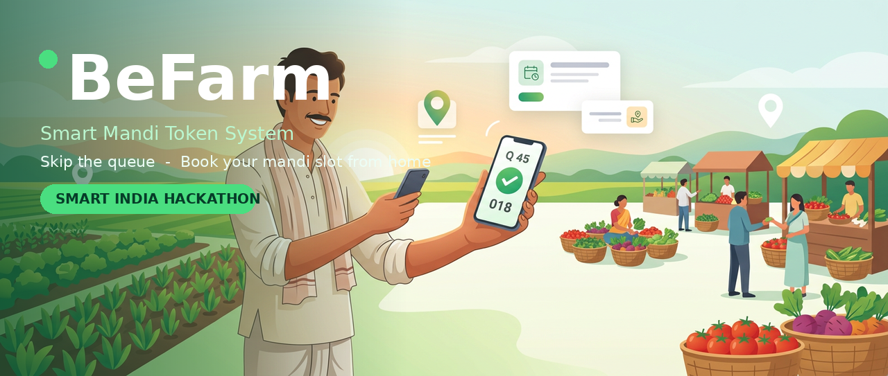
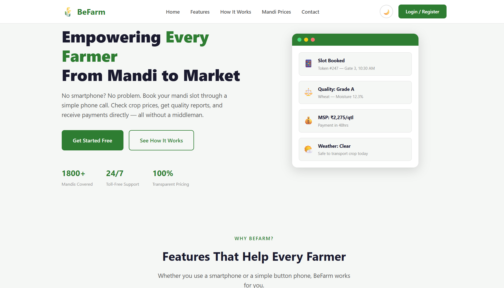
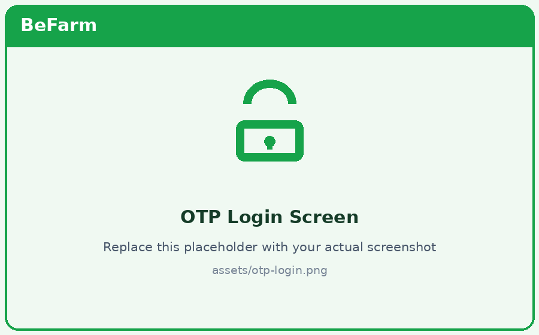
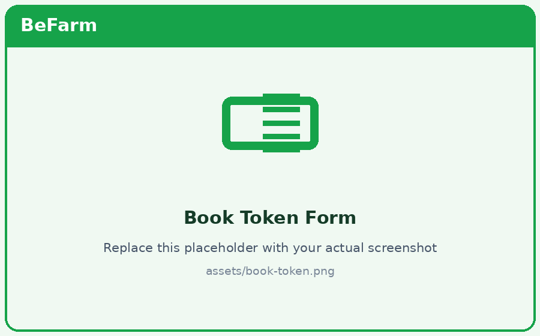
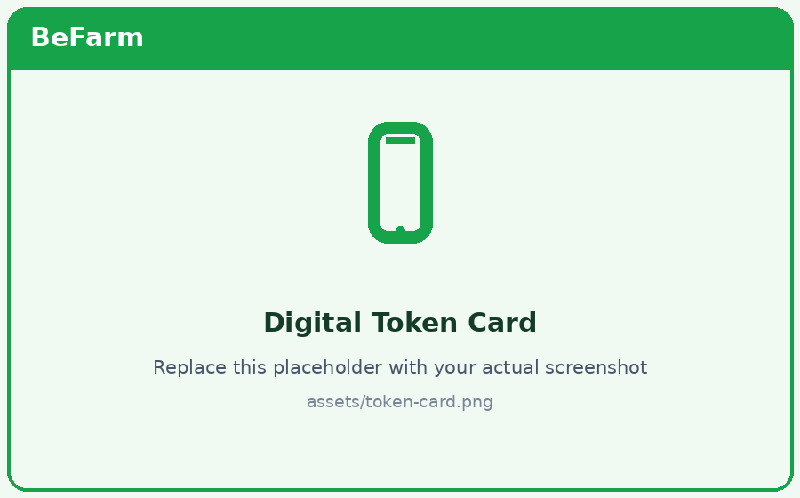

<div align="center">

<br/><br/>
<a href="https://git.io/typing-svg">
  
</a>
<br/>
A farmer-friendly frontend web app that generates digital mandi-visit tokens online — so farmers no longer wait for hours in long market queues.
<br/>


<br/>


</div>
---
📖 Table of Contents
|  |  |  |
|:---:|:---|:---:|:---|
| 🌾 | Overview | 😰 | The Problem |
| 💡 | The Solution | ✨ | Features |
| 🧰 | Tech Stack | 📸 | Screenshots |
| 📂 | Project Structure | 🚀 | Getting Started |
| 🔗 | API Integration | 🗺️ | User Flow |
| 🔮 | Future Scope | 👥 | Team |
---
🌾 Overview
BeFarm (Smart Mandi Token System) is a web application designed for farmers to book a slot at their nearest government mandi using their mobile phone. Instead of reaching the market before dawn and standing in long queues, a farmer can now register, log in with an OTP, book a crop-selling slot and instantly receive a digital token — then visit the mandi only when their turn is near.
This repository contains the frontend, built with pure HTML5, CSS3 and JavaScript, and it consumes the REST APIs built by the backend team.
---
😰 The Problem
<div>
⏳ Farmers spend hours waiting in long queues just to get a token to sell their crops
<br/>
🌞 Waiting outdoors in heat and rain with no fixed time for their turn
<br/>
🚸 Overcrowded markets lead to mismanagement and wasted produce time
<br/>
🚫 There is no advance information about available slots or selling status
</div>
---
💡 The Solution
<div align="center">
1️⃣ Register	2️⃣ OTP Login	3️⃣ Book Slot	4️⃣ Get Token
Farmer signs up with name, mobile & Aadhaar	Secure OTP on mobile	Pick mandi, crop & quantity	Digital token with slot number
</div>
> 🎯 **Rural-first design** — large touch-friendly buttons, big readable fonts, a simple step-by-step flow and minimal typing, so the app works comfortably on low-end phones and slow networks.
---
✨ Features
<table>
<tr>
<td width="50%">
👨‍🌾 Farmer Experience
📝 Easy Registration with client-side validation
🔐 OTP-based login (request & verify)
🎫 One-click token booking for crop & mandi
⚖️ Enter estimated crop quantity in quintals
📲 Digital Token Card — screenshot-friendly
🔍 Live token & crop status tracking
🌐 Fully responsive, mobile-first layout
⚠️ Friendly success & error messages
</td>
<td width="50%">
🛠️ Frontend Engineering
⚡ Vanilla JS (ES6+) — lightweight, no framework
🔄 Fetch API + Async/Await REST integration
🧩 Reusable CSS components (buttons, cards, inputs)
🎨 CSS Variables, Flexbox & Grid layout
⏳ Loading spinners during API calls
✅ Forms validated before hitting the server
🔌 One-file API config (local ↔ deployed switch)
📁 Clean, organised & commented code
</td>
</tr>
</table>
---
🧰 Tech Stack
<div align="center">
Layer	Technology
🧱 Markup	HTML5 — semantic tags, accessible forms
🎨 Styling	CSS3 — Flexbox, Grid, Variables, Animations
⚙️ Logic	Vanilla JavaScript (ES6+), Async/Await, Fetch API
🖼️ Icons & Fonts	Font Awesome · Google Fonts
🔌 Backend API	FastAPI (Python) — backend team
🗄️ Database	MySQL — backend team
📨 SMS / OTP	Fast2SMS — backend team
🛠️ Tools	VS Code · Git & GitHub · Live Server
</div>
---
📸 Screenshots
> 📌 Replace the placeholder images inside the `assets/` folder with screenshots of your actual pages (keep the same file names).
<div align="center">
  

<br/><br/>
  

</div>
---
📂 Project Structure
```
BeFarm/
├── index.html               # Landing page
├── register.html            # Farmer registration
├── login.html               # Mobile + OTP login
├── book-token.html          # Crop & slot booking
├── token-status.html        # Digital token & live status
│
├── css/
│   ├── style.css            # Global styles & theme variables
│   ├── forms.css            # Inputs, buttons, validation
│   └── responsive.css       # Mobile-first media queries
│
├── js/
│   ├── config.js            # API base URL & constants
│   ├── api.js               # Fetch wrapper for REST calls
│   ├── auth.js              # Send / verify OTP logic
│   ├── register.js          # Registration handling
│   ├── booking.js           # Crop slot booking
│   ├── token.js             # Token status rendering
│   └── main.js              # Shared helpers & navigation
│
└── assets/
    ├── banner.png           # README banner
    ├── home.png             # Screenshot placeholders (replace later)
    ├── otp-login.png
    ├── book-token.png
    └── token-card.png
```
---
🚀 Getting Started
<details open>
<summary><b>📋 Click to expand / collapse setup steps</b></summary>
<br/>
No build step, no npm install — just pure HTML, CSS & JavaScript. ✅
1️⃣ Clone the repository
```bash
git clone https://github.com/princeinnovation/BeFarm.git
cd BeFarm
```
2️⃣ Run it — choose either way
🖱️ Quickest: double-click `index.html` to open it in your browser
🟢 Recommended (VS Code):
Install the Live Server extension
Right-click `index.html` → Open with Live Server
App runs at `http://127.0.0.1:5500`
> 💡 Use Live Server because the app makes `fetch()` API calls, which need a running server in some browsers.
3️⃣ Connect the backend (see next section) and you're done! 🌾
</details>
---
🔗 API Integration
Set the backend URL in one place — `js/config.js`:
```javascript
const CONFIG = {
  API_BASE_URL: "http://127.0.0.1:8000",   // local FastAPI server
  // API_BASE_URL: "https://your-backend.onrender.com",  // deployed
};
```
<details>
<summary><b>🔌 Endpoints used by the frontend (click to expand)</b></summary>
<br/>
Screen Action	Method	Endpoint
Send OTP	`POST`	`/send-otp/`
Verify OTP / Login	`POST`	`/verify-otp/`
Register farmer	`POST`	`/register-farmer/`
Book crop slot (token)	`POST`	`/book-crop-slot/`
Farmer's crop bookings	`GET`	`/farmer-crop/{farmer_id}`
Farmer's token details	`GET`	`/farmer/token/{farmer_id}`
Sample fetch call:
```javascript
// js/auth.js
async function requestOTP(mobile) {
  try {
    const res = await fetch(`${CONFIG.API_BASE_URL}/send-otp/`, {
      method: "POST",
      headers: { "Content-Type": "application/json" },
      body: JSON.stringify({ mobile_number: mobile }),
    });

    if (!res.ok) throw new Error("Could not send OTP");
    return await res.json();
  } catch (err) {
    showToast("Something went wrong. Please try again.", "error");
  }
}
```
</details>
---
🗺️ User Flow
```
        🏠 Landing Page
              │
     ┌────────┴────────┐
     ▼                 ▼
📝 Register       🔐 OTP Login
     └────────┬────────┘
              ▼
   🌾 Select Mandi → Crop → Quantity
              │
              ▼
      🎫 Digital Token Generated
              │
              ▼
   📊 Track Token / Selling Status
```
---
🔮 Future Scope
🌐 Hindi / English language toggle for rural users
🔔 WhatsApp & SMS slot reminders
📍 Mandi map, directions & distance
📊 Real-time mandi crowd indicator
📲 Installable PWA with offline support
🌙 Dark mode & accessibility (screen-reader) improvements
---
👥 Team
Built with 💚 during Smart India Hackathon.
Role	Responsibility
🎨 Frontend Developer	HTML5, CSS3, JavaScript — complete farmer UI, responsiveness & API integration
⚙️ Backend Developer	FastAPI, MySQL, OTP (Fast2SMS), REST APIs & admin system
---
🤝 Contributing
Contributions are welcome! Feel free to fork the repo, create a branch, and open a pull request. For major changes, please open an issue first.
Fork the Project
Create your Feature Branch (`git checkout -b feature/AmazingFeature`)
Commit your Changes (`git commit -m "Add AmazingFeature"`)
Push to the Branch (`git push origin feature/AmazingFeature`)
Open a Pull Request
---
📄 License
Distributed under the MIT License. See `LICENSE` for more information.
<div align="center">
<br/>
🌱 Empowering farmers through simple, smart technology.
If this project helped you or you like the idea, please give it a ⭐ — it means a lot!
<br/>

</div>
